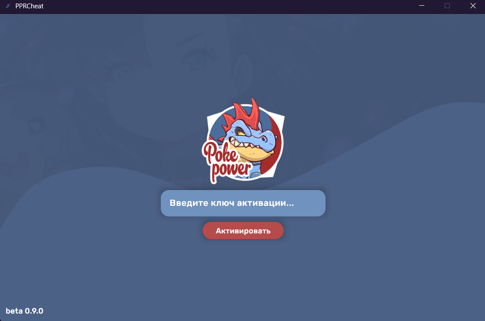
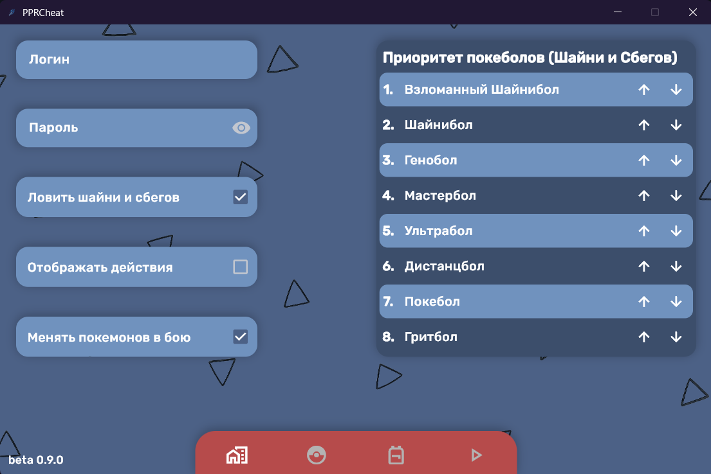
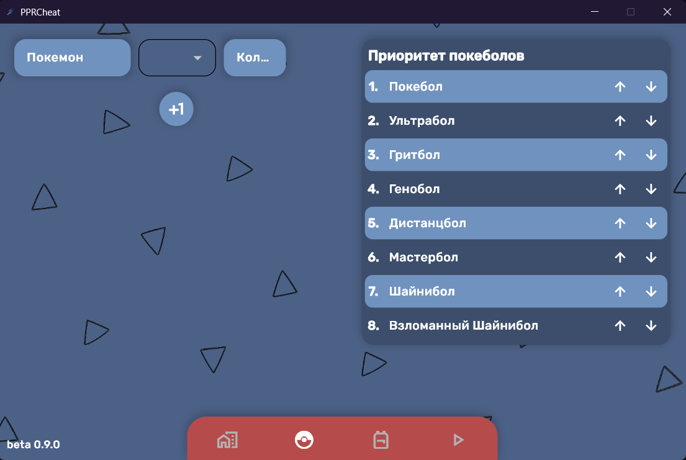
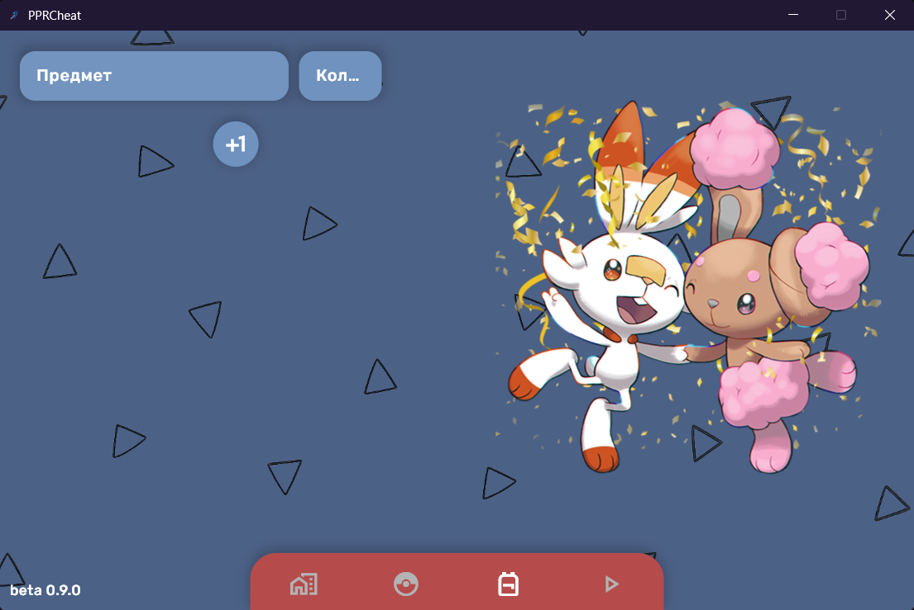

# 🎮 PokePowerRequests (PPRCheat)

**PokePowerRequests** — это десктопное приложение для автоматизации игровых процессов в игре PokePower. Программа предоставляет удобный интерфейс для настройки и запуска бота, который выполняет задачи по ловле покемонов и сбору предметов.

---

## 📋 Оглавление

- [Возможности](#-возможности)
- [Скриншоты](#-скриншоты)
- [Установка](#-установка)

---

## 🚀 Возможности

- 🔐 **Активация по лицензионному ключу** — защита от несанкционированного использования.
- 🎯 **Настройка целей** — выбор покемонов для ловли и предметов для сбора.
- 📊 **Приоритет покеболов** — настройка порядка использования покеболов.
- 📋 **Логирование в реальном времени** — отслеживание действий бота.
- 🎨 **Современный интерфейс** — на основе Flet с поддержкой тёмной темы.
- 🖥️ **Кроссплатформенность** — работа на Windows (в будущем планируется поддержка Android).

---

## 📸 Скриншоты

|               Экран активации               |             Главный экран              |              Экран покемонов               |             Экран предметов              |
|:-------------------------------------------:|:--------------------------------------:|:------------------------------------------:|:----------------------------------------:|
|  |  |  |  |

---

## 📦 Установка

### Для пользователей (готовый установщик)

1. Скачайте последнюю версию установщика `PPRCheat_Setup.exe` из раздела [Releases](https://github.com/BEJlYA/PokePowerRequests/releases).
2. Запустите установщик и следуйте инструкциям.
3. После установки запустите программу через ярлык на рабочем столе или в меню "Пуск".

### Для разработчиков (из исходников)

```bash
# Клонируйте репозиторий
git clone https://github.com/BEJlYA/PokePowerRequests.git
cd PokePowerRequests

# Создайте и активируйте виртуальное окружение
python -m venv .venv
source .venv/bin/activate  # Linux/macOS
# или
.venv\Scripts\activate     # Windows

# Установите зависимости
pip install -r requirements.txt

# Запустите приложение
flet run main.py